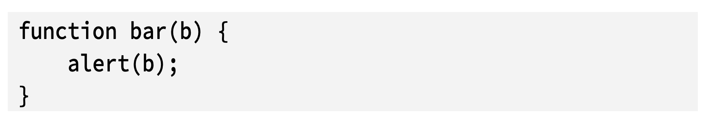
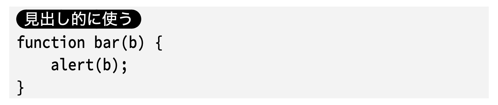

Markdown to Inao-Format
================

[](https://heroku.com/deploy)

[](https://travis-ci.org/naoya/md2inao) [](https://coveralls.io/r/naoya/md2inao)

概要
----

Markdownで書かれたテキストをWEB+DB PRESS編集部で使用しているInDesign用フォーマットに変換します。主にWEB+DB PRESS編集部の方のためのツールですが、執筆者にとってもMarkdownの原稿がWEB+DB PRESSの原稿のスタイルに従っているかどうかをチェックするツールとして使えます。

- bin/md2inao.pl : CUIコマンド版
- http://md2inao.bloghackers.net/ : Web版

markdown2inao.pl 改め md2inao.pl のこれまでについては https://gist.github.com/inao/baea09bc6fc53551886b を見て下さい。なお、md2inaoは当初「inao記法」に変換していましたが、現在はWEB+DB PRESS編集部用InDesignフォーマットを出力します。

使い方
-----

### CUI版

    % md2inao.pl your_markdown.md > path/to/output.txt

#### CPANからインストール

    # webからcpanmをDLしてそのままそれを使ってmd2inaoをインストール
    % curl -L http://cpanmin.us | perl - --sudo Text::Md2Inao
    % md2inao.pl your_markdown.md > path/to/output.txt

#### リポジトリからインストール

リポジトリからインストールする場合、Perl/CPANの知識が必要です。

    % cpanm Carton
    % carton install
    % carton exec -- perl bin/md2inao.pl your_markdown.md > path/to/output.txt

### Web版

- http://md2inao.bloghackers.net/

### 変換したテキストのInDesignへの取り込み方

[こちら](indesign.md)にまとめました。

出力見本
-------

PDFにすると、以下のような仕上がりになります。

### 書籍版

- https://docs.google.com/open?id=0BzbGMS73rIkDUXpyUVlrSUxURXlmMXhQRV9Ua2JCUQ

### WEB+DB PRESS版

- https://docs.google.com/open?id=0BzbGMS73rIkDZjdCTnBkMDFUaGF2UDJIdTNfaVJUUQ

Markdownでの原稿の書き方
----------------------

md2inao を利用すると Markdown フォーマットで原稿を書くことができますが、当然のことながら、なんの制約もなく Markdown フォーマットで書けばよしなに変換してくれるというものではありません。以下、原稿を書くにあたっての Markdown の使い方について解説します。

### 原稿の例

    Title: RubyMotion入門
    Subtitle: RubyでiOSネイティブアプリ!
    Author: 伊藤 直也
    Author(romaji): ITO Naoya
    Twitter: @naoya_ito

    # RubyMotion とは

    　[RubyMotion](http://rubymotion.com/) は、RubyでiOSのネイティブアプリケーションが作れるツールチェインです。Apple で MacRuby を開発していた Laurent Sansonetti さんが Apple 退職後に興した会社 Hipbyte が、2012年5月に発売を開始しました。

    # RubyMotion で Hello, World

    　早速コードを書いてみましょう。以下が Hello, World のコードです。

        class HelloViewController < UIViewController
          def viewDidLoad
            super
            @label = UILabel.new
            @label.frame = [[10, 10], [320, 20]]
            @label.text = "Hello, World"

            view.addSubview(@label)
          end
        end

    簡単ですね！

    - HelloViewController を定義
    - `viewDidLoad` をオーバーライド
    - `UILabel.new` でラベルインスタンスを作成
    - `view.addSubview` でビューに追加

    しているだけです。出力は以下のようになります。

    

### 基本的な考え方

Markdown は Markdown プロセッサで解釈すると、通常は HTML に変換されます。md2inao はその HTML の各要素を WEB+DB PRESS編集部用InDesignフォーマット に変換して最終的な出力を作っています。

従って Markdown を書きながらも出力される HTML 構造がどの要素になって、その要素が論理構造的にどういったものか、をある程度想定しておけばだいたい想像した通りの出力になると思ってください。

また、Markdown で定義されてない記述も HTML を使うことによって定義することもできます。一部の記法は HTML で書くことが前提になっています。

#### 文中に HTML を書く際の注意事項

Markdown の仕様では当然のことながら、HTML タグは HTML タグとして解釈されます。文中に HTML を書きたい場合は以下のいずれかの方法でエスケープしてください。

##### code 記法を使う

    `<strong>`

##### 実体参照を使う

    &lt;strong&gt;

### メタデータ（タイトル、著者名など）

テキストファイルの冒頭に、以下のメタデータを書きます。メタデータには原稿や書籍のタイトル、章番号、著者名などの情報を入力してください。本メタデータは http://hiltmon.com/blog/2012/06/18/markdown-metadata/ の仕様に従っていますが、GitHub Flavored Markdown では解釈されないため、GitHub 上では HTML での表示が崩れますがスルーしてください。

    Chapter: 3（章番号）
    Serial: 5（連載回数）
    Title: Markdown to Inao（タイトル）
    Subtitle: Convert markdown text to Inao format（キャッチコピー）
    Author: 伊藤 直也（著者名）
    Author(romaji): ITO Naoya（著者名のローマ字表記）
    Supervisor: 山田 太郎（監修者名）
    Supervisor(romaji): YAMADA Taro（監修者名のローマ字表記）
    Affiliation: 技術評論社（所属）
    URL: http://naoya.github.com/
    mail: i.naoya@gmail.com
    GitHub: naoya
    Twitter: @naoya_ito

    Hello, World（本文）

#### 注意事項

- Title、Subtitle、Author、Author(romaji)は必須です
- テキストファイルの冒頭に書く必要があります
- メタデータと本文の間に空行が必要です
- 任意のメタデータを追加可能ですが、キーにマルチバイト文字は使えません

### 見出し

各章の配下、各記事（連載、一般記事）の配下には、見出しが3階層まで使えます。

    # 大見出し（節）
    ## 中見出し（項）
    ### 小見出し（目）

書籍で節番号をふる場合は、次のように書きます。

    ▼1.1
    # 大見出し（節）

#### 注意事項

章に`#`をお使いになる方が多いですが、`#`は上記のように大見出しにお使いください。
章の分割はテキストファイルの分割で認識します。

#### 非推奨

md2inao的には以下の記法にも対応していますが、現状は非推奨です（アウトラインの作成がちょっとめんどうになるので）。

    大見出し（節）
    ===============

    中見出し（項）
    ---------------

### 箇条書き（リスト）

#### 箇条書き

両記法に対応していますが、同一原稿では、どちらかで統一してください。

    * 箇条書き
    * 箇条書き
    * 箇条書き

    - 箇条書き
    - 箇条書き
    - 箇条書き

#### 階層付き箇条書き（ネストしたリスト）

両記法に対応していますが、同一原稿では、どちらかで統一してください。

    * 箇条書き
        * 箇条書き2階層目
        * 箇条書き2階層目
        * 箇条書き2階層目

    - 箇条書き
        - 箇条書き2階層目
        - 箇条書き2階層目
        - 箇条書き2階層目

##### 注意事項

* GitHub Flavored Markdownでは半角スペース1～3つの行頭字下げによるネストにも対応していますが、md2inaoは4つ以上にのみ対応しています
* 3階層目は使用できません

#### 説明付き箇条書き（dt、dd）

Markdown の説明付き箇条書きには対応していないので、HTML でマークアップしてください。

    <dl>
      <dt>箇条書き</dt>
      <dd>箇条書きの説明文</dd>
      <dt>箇条書き</dt>
      <dd>箇条書きの説明文</dd>
    </dl>

##### 注意事項

* この説明付き箇条書きのようなHTMLで記述した箇条書き中では、`_イタリック_`や`**強調**`などの文中記号は使えません（以降のHTML系の箇条書きでも同様です）

#### 連番箇条書き（黒丸数字）

黒丸囲みの1、2、3……が行頭に付きます。

    1. 連番箇条書き
    2. 連番箇条書き
    3. 連番箇条書き

本文で黒丸囲みの1、2、3……を書く場合は、(d1)、(d2)、(d3)と書いてください（discのdです）。

- 手順など順列の箇条書きにのみ使用してください
- 順列ではないけど、行頭記号を区別したい場合は、次のアルファベット箇条書きを使ってください

##### 階層付き箇条書き、説明付き箇条書きと連番箇条書きとの併用

(d1)、(d2)、(d3)といった黒丸数字を明記する必要があります。

    * (d1)箇条書き
        * (d1)箇条書き2階層目
        * (d2)箇条書き2階層目
        * (d3)箇条書き2階層目

    <dl>
      <dt>(d1)箇条書き</dt>
      <dd>(d1)箇条書きの説明文</dd>
      <dt>(d2)箇条書き</dt>
      <dd>(d1)箇条書きの説明文</dd>
    </dl>

###### 注意事項

* 段落スタイル「箇条書き説明」は、行頭に記号が入る前提では設定していないので、折り返されて2行以上になる場合は、2行目以降はインデントがおかしくなります。インデントの調整が必要な旨の制作指示を書くなどして対応する必要があります

##### そのほかの連番箇条書き（白丸数字、黒四角数字）

上述した連番箇条書き（黒丸数字）がデフォルトですが、白丸数字や黒四角数字にすることもできます。連番箇条書きが連続して登場し紛らわしくなる場合などにご利用ください。

    <ol class='circle'>
        <li>連番箇条書き（白丸数字）</li>
        <li>連番箇条書き（白丸数字）</li>
        <li>連番箇条書き（白丸数字）</li>
    </ol>

本文で白丸囲みの1、2、3……を書く場合は、(c1)、(c2)、(c3)と書いてください（circleのcです）。

    <ol class='square'>
        <li>連番箇条書き（黒四角数字）</li>
        <li>連番箇条書き（黒四角数字）</li>
        <li>連番箇条書き（黒四角数字）</li>
    </ol>

本文で黒四角囲みの1、2、3……を書く場合は、(s1)、(s2)、(s3)と書いてください（squareのsです）。

#### アルファベット箇条書き（黒丸囲み）

黒丸囲みのa、b、c……が行頭に付きます。

    <ol class='alpha'>
        <li>アルファベット箇条書き</li>
        <li>アルファベット箇条書き</li>
        <li>アルファベット箇条書き</li>
    </ol>

本文で黒丸囲みのa、b、c……を書く場合は、(a1)、(a2)、(a3)と書いてください（alphabetのaです）。

### コードブロック（ソースコード、コマンド）

本文中のソースコード、コマンドと、別ボックスのソースコード（リスト）、コマンド（図）がありますが、基本的には前者を使用してください。

#### 本文中のソースコード、コマンド

推奨記法です。  
基本的にはこちらをお使いください。

##### 本文中のコードブロック

GitHub Flavored Markdownの[Fenced code blocks](https://docs.github.com/ja/github/writing-on-github/working-with-advanced-formatting/creating-and-highlighting-code-blocks#fenced-code-blocks)記法でお書きください。

    ```
    function bar(b) {
        alert(b);
    }
    ```



`(注:)`は黒地に白文字となり、見出し的に使えます。

    ```
    (注:見出し的に使う)
    function bar(b) {
        alert(b);
    }
    ```



行頭を半角スペース4つで字下げする記法にも対応していますが、コードの空行も半角スペース4つで字下げする必要があります。  
字下げ漏れがあると、そこは本文扱いとなります。  
ミスが混入しやすいので、基本的にはFenced code blocks記法でお書きください。

        function bar(b) {
            alert(b);
            
        }

##### 本文中のコマンドブロック

GitHub Flavored MarkdownのFenced code blocks記法の場合は、シェル系の言語（[Shell系](https://github.com/github/linguist/blob/master/lib/linguist/languages.yml#L5606-L5609)、[ShellSession系](https://github.com/github/linguist/blob/master/lib/linguist/languages.yml#L5689-L5691)、[PowerShell系](https://github.com/github/linguist/blob/master/lib/linguist/languages.yml#L4601-L4603)）を指定すると、紙面ではコマンドラインっぽく黒地に白文字になります。

    ```bash
    $ command
    bar
    ```


この場合の`(注:)`は、逆に白地に黒文字となります。

    ```bash
    (注:見出し的に使う)
    $ command
    bar
    ```


行頭を半角スペース4つで字下げする記法の場合は、先頭行に`!!! cmd`と書いてください。  

        !!! cmd
        $ command
        bar

なお、コマンド行の行頭には、上記のようにプロンプト（$など）を書いてください。

##### 注意事項

* コードおよびコマンドは、半角55桁（文字）以内で整形してください
    * 整形が難しい箇所は、コマンドは行末に「（実際は1行）」と書いてください。コードには何も書かないでください
* 整形が必要なのはコードおよびコマンドのみです。コマンドの実行結果は、紙面の右端で折り返しますので整形不要です

#### 別ボックスのソースコード（リスト）、コマンド（図）

紙面での呼称は「リスト」「図」です。  
記事の事情などにより、使う必要がある場合にのみ用いてください。

##### 別ボックスのコードブロック（リスト）

別ボックスの「リスト」として掲載するコードには、上述した「本文中のコードブロック」の記述に加え、冒頭に`●リスト1::キャプション`を書いてください。

    ```
    ●リスト1::キャプション
    (注:見出し的に使う)
    function bar(b) {
        alert(b);
    }
    ```

##### 別ボックスのコマンドブロック（図）

別ボックスの「図」として掲載するコマンドには、上述した「本文中のコマンドブロック」の記述に加え、冒頭に`●図1::キャプション`を書いてください。

    ```bash
    ●図1::キャプション`
    (注:見出し的に使う)
    $ command
    bar
    ```

##### 注意事項

* コードおよびコマンドは、半角63桁（文字）以内で整形してください
    * 整形が難しい箇所は、コマンドは行末に「（実際は1行）」と書いてください。コードには何も書かないでください
* 整形が必要なのはコードおよびコマンドのみです。コマンドの実行結果は、紙面の右端で折り返しますので整形不要です

なお、紙面片段ではなく、両段ぶち抜きのリストや図にすれば、100桁くらいまで入ります。

### 図の画像

以下の両記法に対応していますが、前者を推奨します。

また、必ず独立した段落としてお書きください（本文段落中に書かないでください）。

    

    

※を用いて、図表に対する脚注を付けることもできます。

    
    
    ※図表に対する脚注

### 脚注、リンク

次の2つの記法が使えます。いずれも脚注になり、紙面では両者の違いはありません。

    [リンクの対象](URL)

    脚注の対象(注:脚注文。)

たとえば次のように書きます。

    [RubyMotion](http://rubymotion.com/)は、RubyでiOSアプリを作るれるツールです(注:日本円で20,000円程度です。)。

#### 注意事項

脚注文も「です・ます」調で統一してください。
また、脚注文の末尾にも「。」は必要です。

文末からの脚注の場合、以下のように末尾は「。)。」となります。

* ☓：〜です(注:脚注文です)。
* ☓：〜です。(注:脚注文です。)
* ○：〜です(注:脚注文です。)。

### 表

2つの記法があります。

1つ目は、パイプ文字（`|`)とハイフン（`-`）を用いる記法です。  
こちらの場合、[強調、イタリック、コードなどのMarkdown記法](#markdown記法)が使えます。

    ●表1::キャプション
    
    | 列の説明1 | 列の説明2 |
    | ------- | -------- |
    | 内容1-1  | 内容2-1  |
    | 内容1-2  | 内容2-2  |
    | **強調** | **強調** |
    | _イタリック、italic_ | _イタリック、italic_ |
    | `code`  | `code`  |

2つ目は、HTMLを用いる記法です。  
こちらの場合、[強調、イタリック、コードなどのMarkdown記法](#markdown記法)は使えません。

    <table summary='表1::キャプション'>
        <tr>
            <th>列の説明1</th>
            <th>列の説明2</th>
        </tr>
        <tr>
            <td>内容1-1</td>
            <td>内容2-1</td>
        </tr>
        <tr>
            <td>内容1-2</td>
            <td>内容2-2</td>
        </tr>
    </table>

[ルビ、キーボードフォント、上付きなどのHTML記法](#html記法)は、どちらでも使えます。

### 引用と出典

引用および出典は次のように書きます。

    > 引用です。
    > 
    > 引用です。
    
    ──出典

### 区切り線（`<hr>`）

    ---

### コラム

    <div class='column'>
    #### コラムタイトル
    本文
    ##### コラム内見出し
    本文
    ##### コラム内見出し
    本文
    </div>

### 字下げ

段落行頭の字下げは手動です。全角スペースを入れてください。

    　こんにちは。伊藤です。

### 段落分け

段落分けをするには、空行（2連続の改行）を入れる必要があります。

    　こんにちは。伊藤です。

    　今号から、新連載を始めます。

### 文字記法

これまでの記法は段落全体を指定する段落スタイルでしたが、ここからは段落内の文中で使う文字スタイルです。  
Markdown由来の記法と、HTML由来の記法があります。

#### Markdown記法

##### 強調

    **強調（ボールド）**

##### イタリック

    _斜体（イタリック）_

##### 本文中のコードやコマンド、HTMLタグのエスケープ

    `code or command`

本文での解説中にHTMLを書きたい場合などのエスケープにもご利用ください。

    `<a>`

#### HTML記法

##### ルビ

モノルビ（一つの漢字ごとに読みを示す）を振りたい場合は`monoruby`クラスを使用し、カッコ内で一文字ごとに半角スペースを挟んでください。

```
<span class='monoruby'>辟易(へき えき)</span>
```

グループルビ（熟字訓など、まとめて読みを示す）を振りたい場合は`groupruby`クラスを使用してください。

```
<span class='groupruby'>欠伸(あくび)</span>
```

##### キーボードフォント

    <kbd>A</kbd>

[Keyboard-JP-Regular.otf](https://github.com/n-yuji/keyboard-font)の[対応文字](https://github.com/n-yuji/keyboard-font/blob/master/Keyboardfont_list.pdf)に対応しています。

ただし、現状はInDesignへの取り込み時にShift_JISに変換する必要があるため、Shift_JISにはない文字のキー（~\⇧↵⏎↹⌦⌫）には対応していません。また、 [Issue 95](https://github.com/naoya/md2inao/pull/95) と同様の問題が発生することを避けるため、バッククォート（`）にも対応させていません。

これらの非対応文字も[自由置換](https://github.com/naoya/md2inao#%E8%87%AA%E7%94%B1%E7%BD%AE%E6%8F%9B%E3%81%AE%E6%9B%B8%E3%81%8D%E6%96%B9)に4桁のUnicodeスカラ値を記載する形で設定すれば利用可能ですが、特に使うことがなさそうなキーばかりですので、現状は設定していません。

##### 上付き

    <sup>ゴシックフォントで上付き。コラムなどでの注記で使用</sup>
    <sup2>その場のフォントで上付き。n乗など数式で使用</sup2>

##### 赤文字

編集者へのコメントなどでご利用ください。

    <span class='red'>赤文字</span>

★☆□▲などの記号は、上記記法を用いずとも自動で赤字になります。

### 数式

メタデータとして `UseMath: true` を書くと、インライン数式 `$...$` とディスプレイ数式 `$$...$$` の内部を Markdown として変換せずにそのまま保持するようになります。

    UseMath: true
    
    インライン数式の例: $y = f(x_1, x_2)$
    
    ディスプレイ数式の例:
    
    $$
    f(t) = \lim_{p\to\infty}\frac{1}{2\pi i}\int_{c-ip}^{c+ip} F(s) e^{st} ds
    $$

md2inaoでの変換後に[tex2id](https://github.com/mrkn/tex2id)で再変換すると、TeXの数式がInDesignタグ付きテキストに変換されます（InDesignでも表現できる一部の記法のみに対応しています）。

md2inao デベロッパー向け情報
-------------------------

### テストの実行の仕方

    % carton # モジュールのインストール。初回のみ必要
    % carton exec prove -l

### 自由置換の書き方

```
{
    "before_filter": {
        "<kbd>F10</kbd>" : "<cFont:Key Snd Mother>*<cFont:>",
        "<kbd>F11</kbd>" : "<cFont:Key Snd Mother>+<cFont:>",
        "<kbd>F12</kbd>" : "<cFont:Key Snd Mother>,<cFont:>",
        "<kbd>F1</kbd>" : "<cFont:Key Snd Mother>!<cFont:>",
        "<kbd>F2</kbd>" : "<cFont:Key Snd Mother>\"<cFont:>",
        "<kbd>End</kbd>" : "<cFont:Key Snd Mother>n<cFont:>"
    },
    "after_filter": {
        "★" : "<CharStyle:赤字>★<CharStyle:>",

        "◆→◆" : "<cTypeface:R-KL><cFont:A-OTF リュウミン Pr5><27A1><cTypeface:><cFont:>",
        "◆←◆" : "<cTypeface:R-KL><cFont:A-OTF リュウミン Pr5><2B05><cTypeface:><cFont:>",
        "◆↑◆" : "<cTypeface:R-KL><cFont:A-OTF リュウミン Pr5><2B06><cTypeface:><cFont:>",
        "◆↓◆" : "<cTypeface:R-KL><cFont:A-OTF リュウミン Pr5><2B07><cTypeface:><cFont:>",

        "◆←→◆" : "<21D4>",
        "◆＞＝◆" : "<2267>",
        "◆＝＞◆" : "<2266>",

        "◆WDB◆" : "<cstyle:ストッパ>WDB<cstyle:>"
    }
}
```

- InDesign 出力時は config/id_filter.json に書いた設定通りに出力を置換できます
- キーには正規表現が使えます
- JSON の文法に注意 (末尾のカンマ、" のエスケープなど)

#### before_filter

- Markdown parse の前に置換
- Markdown のテキストを置換したい時は こちら
- HTML を置換したい時もこちら
- 値の &lt;, &gt; はエスケープされてから Markdown parser に渡されます。その後 after_filter で復元されます。(要するに書いたとおりに出力される。HTMLとして処理されることは期待できない、ということ)

#### after_filter

- InDesign への変換が終わった後に置換
- InDesign になったテキストを置換したい時はこちら
- md 中の `<span class="symbol">…</span>` は after_filter 前に` ◆…◆` になります

過去のInDesignのスタイル名で出力したい場合
-------------------------

WEB+DB PRESS Vol.116（2020年4月発売）から、InDesignのバージョンアップに伴い、InDesignのスタイル名を[変更しました](https://github.com/naoya/md2inao/pull/126)。

古い書籍の改訂時など、過去のスタイル名のまま変換したい場合は、タグ[old\-style\-name](https://github.com/naoya/md2inao/releases/tag/old-style-name)段階のものを使用してください。

Authors
----------

* @typester : Original version: https://gist.github.com/typester/380428
* @inao : Current product owner & maintainer
* @naoya : Refactoring, Add some tests, Web version
* @hsbt
* @hokaccha
* @suzuki
* @gfx : Release to CPAN
* @mrkn
* @matobaa
 
LICENSE
----------

* Same as Perl

Contributing
----------

1. Fork it
2. Create your feature branch (git checkout -b my-new-feature)
3. Commit your changes (git commit -am 'Add some feature')
4. Push to the branch (git push origin my-new-feature)
5. Create new Pull Request
